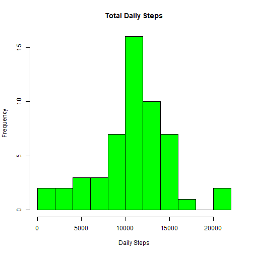
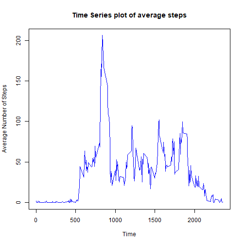
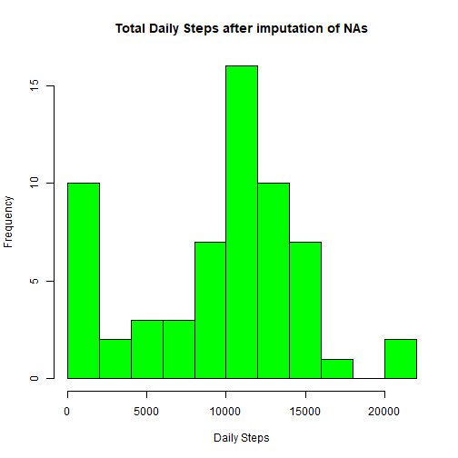
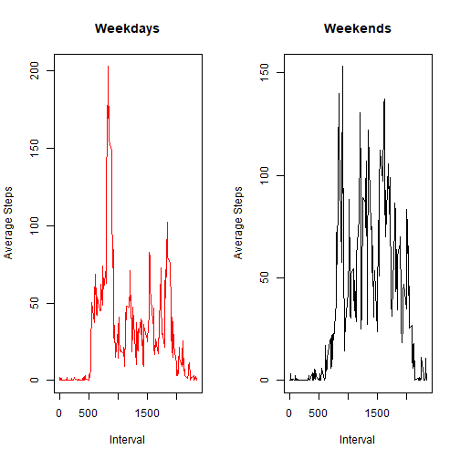

```r
#1. Code for reading in the dataset and processing the data
activity <- read.csv(".\\activity.csv", sep=",", header=TRUE)
```


```r
#2. Histogram of the total number of steps taken each day

library(dplyr)
daily_steps <- summarize(group_by(activity, date), total_steps=sum(steps))
par(mfrow = c(1,1)) # Define the matrix of the plots (only 1 plot here)
hist(daily_steps$total_steps, col="green"
                            , breaks=10 
                            , main = "Total Daily Steps"
                            , xlab="Daily Steps")  
```




```r
#3. Mean and median steps taken each day
mean_steps <- summarize(group_by(activity, date), mean_steps=mean(steps))
median_steps <- summarize(group_by(activity, date), median_steps=median(steps))
```


```r
#4. Time series plot of the average number of steps taken
interval_avg_steps <- summarize(group_by(activity, interval), avg_steps=mean(steps,na.rm=TRUE))
plot(interval_avg_steps, type= "line", col=4, main="Time Series plot of average steps",
     xlab="Time",ylab="Average Number of Steps")
```




```r
#5. The five minute interval that on average, contains the maximum number of steps
max(interval_avg_steps$avg_steps)
```

```
## [1] 206.1698
```

```r
max_mean_steps <-filter(interval_avg_steps, avg_steps == max(interval_avg_steps$avg_steps))
max_mean_steps$interval[1]
```

```
## [1] 835
```


```r
#6. Code to describe and show a strategy or imputing missing data
# If data is missing, then can lead to certain inaccuracies in the results
# One strategy to mitigate such a scenario would be to assign zero to the null values

colSums(is.na(activity))
```

```
##    steps     date interval 
##     2304        0        0
```

```r
activity[is.na(activity)]=0
```


```r
#7. Histogram of the total number of steps taken each day after missing values are imputed
daily_steps <- summarize(group_by(activity, date), total_steps=sum(steps))

par(mfrow = c(1,1)) # Define the matrix of the plots (only 1 plot here)
hist(daily_steps$total_steps, col="green"
     , breaks=10 
     , main = "Total Daily Steps after imputation of NAs"
     , xlab="Daily Steps")  
```




```r
# 8. Panel plot comparing the average number of steps taken per 5-minute interval 
#    across weekdays and weekends

activity$DayOfWeek <- weekdays(as.Date(activity$date))
activity_weekdays <- filter(activity, DayOfWeek %in% c("Monday", "Tuesday", "Wednesday", "Thursday", "Friday"))
activity_weekends <- filter(activity, DayOfWeek %in% c("Saturday", "Sunday"))

mean_steps_wd <- summarize(group_by(activity_weekdays, interval), mean_steps=mean(steps))
mean_steps_we <- summarize(group_by(activity_weekends, interval), mean_steps=mean(steps))

par(mfrow = c(1,2)) # Define the matrix of the plots (only 1 plot here)

plot(mean_steps_wd$interval, mean_steps_wd$mean_steps, type="line"
                             ,main="Weekdays",xlab="Interval", ylab="Average Steps", col=10)
plot(mean_steps_we$interval, mean_steps_we$mean_steps, type="line"
                            ,main="Weekends", xlab="Interval", ylab="Average Steps")
```



